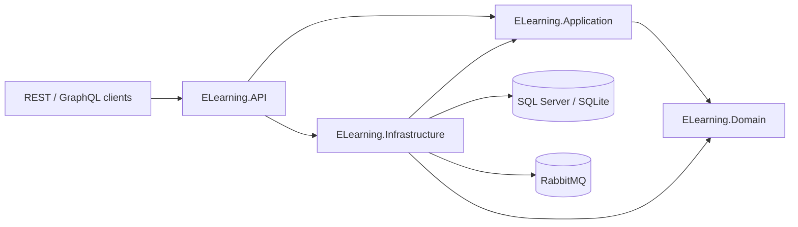
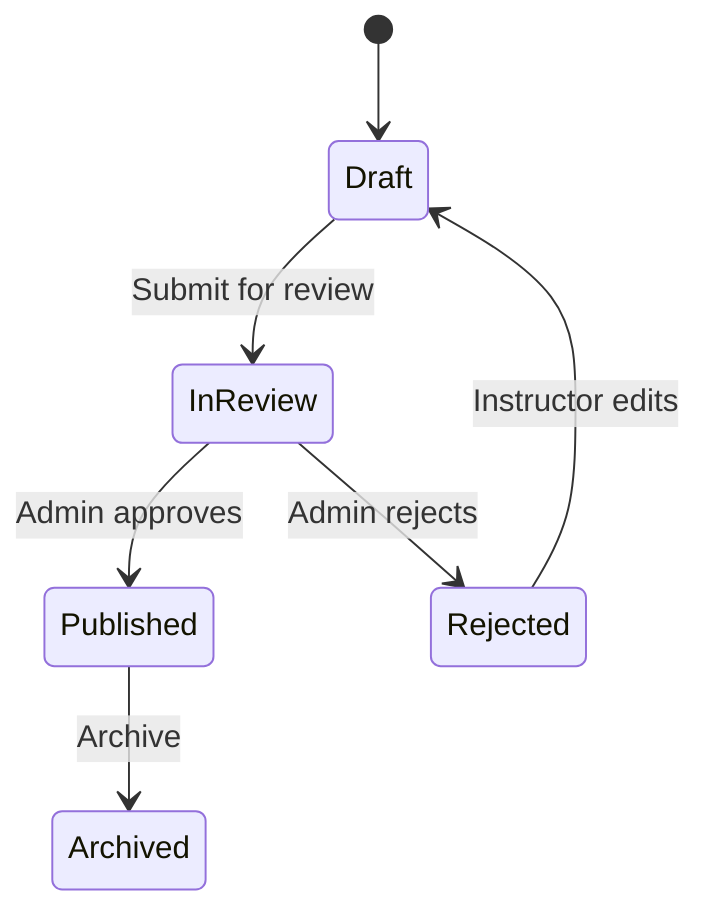

# E-Learning Platform API

[](https://github.com/FarazLoloei/ELearning/actions/workflows/ci.yml)

Backend-focused sample API for an e-learning platform built as a modular monolith with Clean Architecture-style layering, DDD-inspired workflow modeling, CQRS with MediatR, and reliable messaging.

This repository is a .NET backend portfolio project. It is intentionally not a full learning-management product or a production guarantee; it is a focused sample that shows deliberate architecture, credible business workflows, and practical runtime/deployment support for review and local use.

## Why This Project Exists

Many sample backends stop at CRUD. This project is shaped around product workflows instead:

- instructors author courses with modules, lessons, and assignments
- admins govern publication through review, approval, and rejection actions
- students enroll in published courses and progress through lessons
- assessments are submitted and graded
- completion rules unlock review and certificate workflows
- important outcomes are published through an outbox and RabbitMQ-backed notification flow

## Key Features

- JWT authentication with refresh-token rotation
- role-aware workflows for students, instructors, and admins
- course authoring, publication review, approval, rejection, and archiving
- enrollment, lesson progression, assessment submission, grading, reviews, and certificates
- REST API as the primary interface, with GraphQL as a secondary interface
- consistent REST error contracts with `ProblemDetails`
- EF Core write model, Dapper read models, SQL Server migrations, and SQLite in-memory local/test defaults
- outbox pattern, RabbitMQ integration events, and idempotent notification processing
- health endpoints, OpenTelemetry basics, Docker Compose, Kubernetes manifests, CI, tests, and dependency vulnerability scanning

## Technology Stack

| Area | Technologies |
| --- | --- |
| Runtime | .NET 10, ASP.NET Core 10 |
| Architecture | Clean Architecture-style layering, modular monolith, DDD-inspired aggregates |
| Application flow | CQRS with MediatR, FluentValidation pipeline behaviors |
| API | REST controllers, Swagger/OpenAPI, GraphQL with HotChocolate |
| Persistence | EF Core, SQL Server migrations, SQLite in-memory, Dapper read models |
| Messaging | Outbox pattern, RabbitMQ, idempotent notification consumer |
| Security | JWT bearer auth, refresh tokens, role-based authorization, security audit events |
| Observability | Health checks, OpenTelemetry tracing/metrics/logging basics |
| Operations and packaging | Dockerfile, Docker Compose, Kubernetes Kustomize base, GitHub Actions CI |
| Quality | Unit/domain tests, integration tests, architecture tests, dependency vulnerability scanning |

## Architecture At A Glance



The solution keeps business rules in the domain/application layers and keeps infrastructure concerns behind adapters. See [Architecture](docs/architecture.md) for the deeper explanation.

## Business Workflows



Representative workflows:

- instructor creates a course, adds modules/lessons/assignments, and submits it for review
- admin approves or rejects publication
- student enrolls in a published course
- student progresses through lessons and assessments
- completed students can review a course and receive a certificate

## API Capabilities

- auth: login, register, refresh, revoke
- courses: catalog, authoring, lifecycle actions, moderation, reviews
- enrollments: enroll, start lesson, complete lesson, submit review
- submissions: create and grade assessment submissions
- certificates: issue, retrieve by enrollment, verify by public code

Useful endpoints:

- Swagger UI: `/`
- REST: `/api/v1/*` and compatibility routes under `/api/*`
- GraphQL: `/graphql`
- Liveness probe: `/health/live`
- Readiness probe: `/health/ready`

## Messaging, Outbox, And Notifications

Domain events are persisted to an outbox during the same database save. A hosted publisher maps supported outbox messages to integration events and publishes them to RabbitMQ when messaging is enabled. Notification requests use a dedicated `notification.requested.v1` integration event and are handled idempotently by a RabbitMQ consumer.

Implemented routing keys include:

- `course.published.v1`
- `student.enrolled.v1`
- `submission.graded.v1`
- `notification.requested.v1`

See [Messaging](docs/messaging.md) and [ADR 0002](docs/adr/0002-outbox-rabbitmq-notifications.md).

## Observability And Health

- `/health/live` checks the process is alive
- `/health/ready` checks database connectivity
- OpenTelemetry tracing, metrics, and logging are configured at startup
- console export is disabled by default
- OTLP export is enabled only when `Observability:OtlpEndpoint` is configured

## Run Locally

Prerequisites:

- .NET 10 SDK

Configure local JWT secrets:

```powershell
dotnet user-secrets set "JwtSettings:Issuer" "elearning-local" --project ELearning.API/ELearning.API.csproj
dotnet user-secrets set "JwtSettings:Audience" "elearning-local" --project ELearning.API/ELearning.API.csproj
dotnet user-secrets set "JwtSettings:Secret" "your-long-random-secret-at-least-32-characters" --project ELearning.API/ELearning.API.csproj
dotnet user-secrets set "JwtSettings:ExpiryInDays" "7" --project ELearning.API/ELearning.API.csproj
dotnet user-secrets set "JwtSettings:RefreshTokenExpiryInDays" "14" --project ELearning.API/ELearning.API.csproj
dotnet user-secrets set "Ocelot:Enabled" "false" --project ELearning.API/ELearning.API.csproj
```

Run the API:

```powershell
dotnet run --project ELearning.API/ELearning.API.csproj
```

## Docker Compose Quick Start

The local container stack runs the API with SQL Server and RabbitMQ:

```powershell
Copy-Item .env.example .env
docker compose up --build -d
```

Services:

- API: `http://localhost:8080`
- RabbitMQ management UI: `http://localhost:15672`
- SQL Server: `localhost,1433`

Validate health:

```powershell
Invoke-RestMethod http://localhost:8080/health/live
Invoke-RestMethod http://localhost:8080/health/ready
```

Stop the stack:

```powershell
docker compose down
```

## Kubernetes Base Manifests

Kustomize base manifests live under `deploy/kubernetes/base` and include:

- API deployment
- ClusterIP service
- ConfigMap
- example Secret
- liveness, readiness, and startup probes
- resource requests and limits

The Kubernetes files model SQL Server and RabbitMQ as external dependencies. For a real environment, use managed services or dedicated operators instead of treating these sample manifests as full production infrastructure.

Render manifests:

```powershell
kubectl kustomize deploy/kubernetes/base
```

## Validate The Project

```powershell
dotnet restore ELearning.sln
dotnet build ELearning.sln -nologo /p:UseSharedCompilation=false
dotnet test ELearning.sln -nologo /p:UseSharedCompilation=false
dotnet list ELearning.sln package --vulnerable --include-transitive
docker compose config
kubectl kustomize deploy/kubernetes/base
```

The validation commands above let readers run the current test suite and deployment checks locally.

## Documentation

- [Architecture](docs/architecture.md)
- [Messaging](docs/messaging.md)
- [Deployment](docs/deployment.md)
- [Testing](docs/testing.md)
- [ADR 0001: Modular Monolith](docs/adr/0001-modular-monolith.md)
- [ADR 0002: Outbox, RabbitMQ, And Notifications](docs/adr/0002-outbox-rabbitmq-notifications.md)

## Security Notes

- JWT secrets are configured through user secrets, environment variables, or Kubernetes Secrets.
- Development `.env.example` values are examples only and should not be reused for real environments.
- CI runs restore, build, tests with coverage, and transitive dependency vulnerability scanning.
- The sample does not include a real SMTP provider, payment provider, file storage provider, or production identity provider.

## Known Limitations

- Email delivery is represented by an application seam and logging implementation, not a real SMTP or third-party provider.
- Kubernetes manifests are sample API deployment artifacts, not a full production platform.
- SQL Server and RabbitMQ production hosting are intentionally left to managed services or dedicated operators.
- GraphQL is secondary and does not attempt to expose every REST workflow.
- The project focuses on backend architecture and workflows, not a frontend UI.

## Why This Repo Is Useful As A Backend Sample

This project is useful as a backend sample because it shows explicit workflow modeling, clear layer boundaries, pragmatic CQRS, provider-aware persistence, reliable messaging patterns, observable health endpoints, and meaningful automated tests without expanding into a full platform.

## License

MIT. See [LICENSE.txt](LICENSE.txt).
