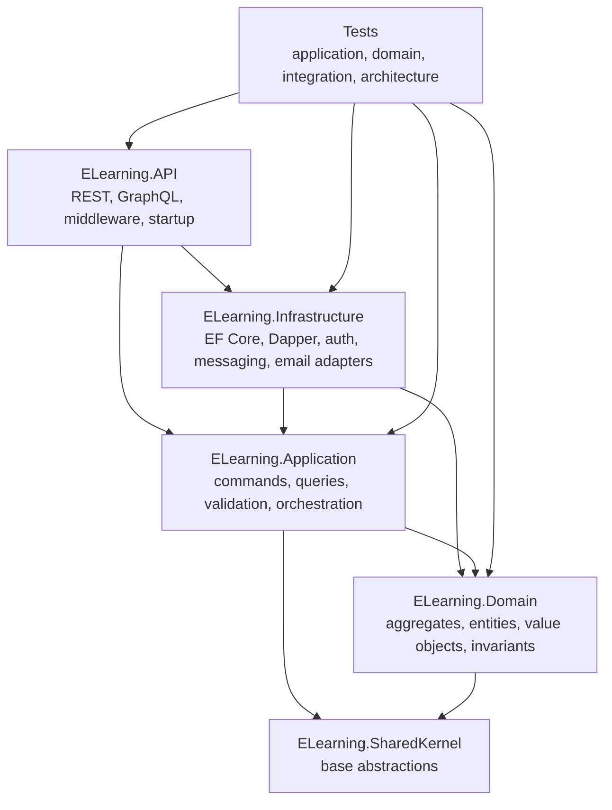
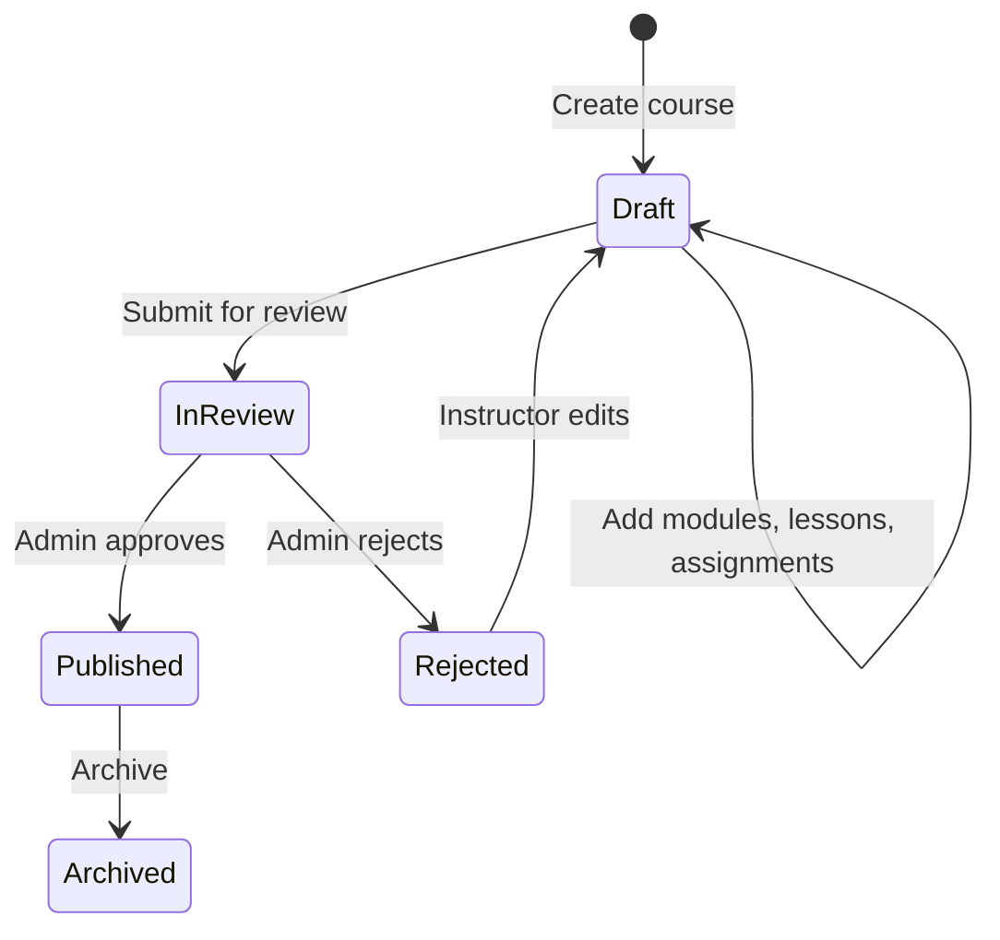

# Architecture

This application is a production-inspired modular monolith. It uses Clean Architecture-style dependency direction, DDD-inspired tactical modeling where it adds clarity, and CQRS with MediatR for application use cases.

## Layered Structure

Dependency direction points inward toward the domain. Infrastructure implements adapters and persistence details; it does not own business workflow decisions.

## Project Responsibilities

| Project | Responsibility |
| --- | --- |
| `ELearning.API` | HTTP/GraphQL transport, authentication setup, middleware, Swagger, health checks, composition root |
| `ELearning.Application` | Use-case orchestration through commands and queries, validation, DTOs, transaction pipeline |
| `ELearning.Domain` | Business invariants, aggregate behavior, value objects, domain events |
| `ELearning.Infrastructure` | EF Core repositories, Dapper read models, SQL dialects, JWT adapters, email seam, outbox, RabbitMQ |
| `ELearning.SharedKernel` | Small shared abstractions such as base entity/domain event contracts |
| `ELearning.Application.Tests` | Domain and application behavior tests |
| `ELearning.IntegrationTests` | HTTP, infrastructure, health, authorization, outbox, and configuration behavior |

## Business Modules

- Auth and user registration
- Course authoring and lifecycle governance
- Modules, lessons, and assignments
- Enrollment and lesson progression
- Submissions and grading
- Reviews and ratings
- Certificate issuance and verification
- Notifications through outbox/RabbitMQ

## Course Authoring Workflow

Course lifecycle rules are enforced by domain behavior rather than controllers. Application handlers orchestrate repository access, authorization checks, and transaction boundaries.

## CQRS And Validation

Commands and queries are represented with MediatR request handlers. FluentValidation validates request models before handlers execute. Cross-cutting behaviors include validation, logging, and transaction handling.

This is pragmatic CQRS, not a separate service or separate database-per-side architecture.

## Persistence

- EF Core is used for the write model and aggregate persistence.
- SQL Server is the production-capable relational provider and uses migrations.
- SQLite in-memory is the default lightweight local/test provider.
- Dapper read repositories provide focused read models.
- Provider-aware SQL helpers keep Dapper reads honest across supported providers.

## API Surface

REST is the primary API. GraphQL is available as a secondary interface and reuses the same application use cases. The project avoids duplicating business logic in transport layers.

## Tradeoffs

- Modular monolith over microservices keeps the sample reviewable and avoids distributed complexity that the product does not yet need.
- DDD patterns are used where they protect meaningful rules, not for every object.
- Messaging is included for reliability and asynchronous notification delivery, not as a microservice boundary.
- Kubernetes manifests show deployment readiness for the API, not a full production platform.
