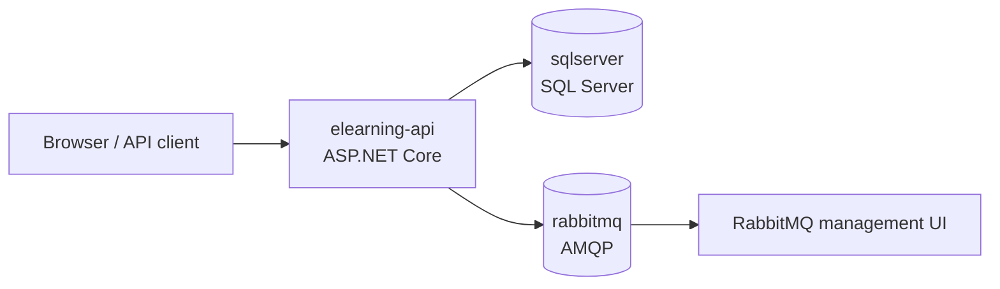
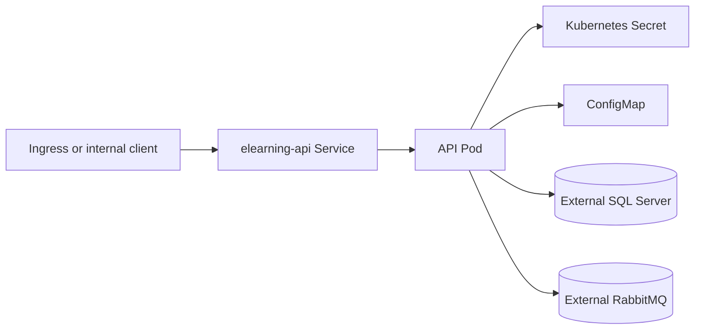

# Deployment

The project includes deployment-readiness artifacts for local containers and basic Kubernetes API manifests. These files are meant to make the sample runnable and reviewable outside the IDE.

They are not a complete production platform.

## Docker Compose

Compose starts:

- `elearning-api`
- `sqlserver`
- `rabbitmq`



Start the stack:

```powershell
Copy-Item .env.example .env
docker compose up --build -d
```

Useful URLs:

- API: `http://localhost:8080`
- Swagger UI: `http://localhost:8080/`
- RabbitMQ management UI: `http://localhost:15672`
- SQL Server: `localhost,1433`

Health checks:

```powershell
Invoke-RestMethod http://localhost:8080/health/live
Invoke-RestMethod http://localhost:8080/health/ready
```

Stop the stack:

```powershell
docker compose down
```

Remove local volumes if you want a clean database and broker state:

```powershell
docker compose down -v
```

## Container Configuration

Key environment variables:

- `ASPNETCORE_URLS=http://+:8080`
- `Database__Provider=SqlServer`
- `ConnectionStrings__DefaultConnection`
- `JwtSettings__Issuer`
- `JwtSettings__Audience`
- `JwtSettings__Secret`
- `RabbitMq__Enabled=true`
- `RabbitMq__HostName=rabbitmq`
- `RabbitMq__UserName`
- `RabbitMq__Password`
- `Observability__ConsoleExporterEnabled`
- `Observability__OtlpEndpoint`

The API runs EF Core migrations on startup when the provider is SQL Server.

## Kubernetes Base

Kustomize manifests live under `deploy/kubernetes/base`.

Included:

- API deployment
- ClusterIP service
- ConfigMap
- example Secret
- liveness, readiness, and startup probes
- resource requests and limits



Render manifests:

```powershell
kubectl kustomize deploy/kubernetes/base
```

Client dry-run, when a local cluster context is available:

```powershell
kubectl apply --dry-run=client -k deploy/kubernetes/base
```

## Production Caveats

- The Kubernetes base does not deploy SQL Server or RabbitMQ.
- Use managed services or dedicated operators for real database/broker hosting.
- Replace `api-secret.example.yaml` values before applying anything to a real cluster.
- Add Ingress, TLS, network policies, autoscaling, and centralized observability according to the target environment.
- This repo intentionally avoids cloud-provider-specific deployment.
