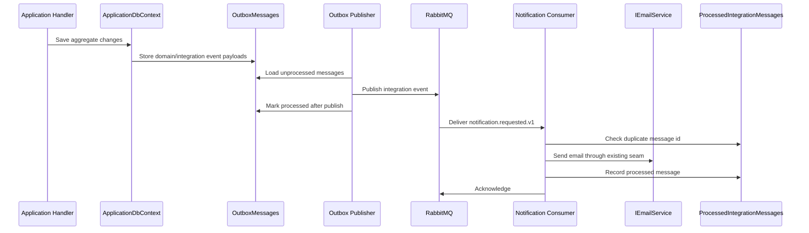

# Messaging

Messaging is implemented as a reliability feature inside the modular monolith. Domain events are captured in an outbox, mapped to integration events, and published to RabbitMQ when messaging is enabled.

## Flow

## Domain Events vs Integration Events

Domain events describe things that happened inside the domain model. Integration events are external contracts published through RabbitMQ.

The outbox mapper currently supports:

| Source | Routing key | Integration event |
| --- | --- | --- |
| Course publication | `course.published.v1` | `CoursePublishedIntegrationEvent` |
| Enrollment creation | `student.enrolled.v1` | `StudentEnrolledIntegrationEvent` |
| Submission grading | `submission.graded.v1` | `SubmissionGradedIntegrationEvent` |
| Notification request | `notification.requested.v1` | `NotificationRequestedIntegrationEvent` |

Unsupported internal events are intentionally skipped by the publisher and marked processed so they do not block the outbox.

## Outbox Publisher

The outbox publisher is a hosted service registered only when `RabbitMq:Enabled=true`.

Behavior:

- reads unprocessed outbox messages in order
- maps supported rows to integration events
- publishes JSON messages to a durable RabbitMQ topic exchange
- sets message id from the outbox id
- uses persistent delivery mode and publisher confirmations
- marks a row processed only after successful publish
- stores error and increments retry count on failure

When RabbitMQ is disabled, the application still runs and does not require a broker.

## Notification Requests

Application workflows use `INotificationRequestService` instead of directly depending on RabbitMQ.

When RabbitMQ is disabled:

- notification requests call the existing `IEmailService` directly
- local development and tests do not need a broker

When RabbitMQ is enabled:

- notification requests write `NotificationRequestedIntegrationEvent` to the outbox
- the outbox publisher sends it to RabbitMQ
- the notification consumer handles it asynchronously

## Idempotency

The notification consumer records processed messages in `ProcessedIntegrationMessages`.

The key is:

- `MessageId`
- `Consumer`

Before sending email, the consumer checks whether the message was already processed. Duplicate messages are acknowledged without sending again. Failed email handling does not create a processed record.

## RabbitMQ Configuration

Important settings:

- `RabbitMq__Enabled`
- `RabbitMq__HostName`
- `RabbitMq__UserName`
- `RabbitMq__Password`
- `RabbitMq__ExchangeName`
- `RabbitMq__NotificationQueueName`
- `RabbitMq__DeadLetterExchangeName`
- `RabbitMq__DeadLetterQueueName`

The Docker Compose stack enables RabbitMQ to exercise the outbox publisher and notification consumer locally.

## Intentionally Postponed

- MassTransit
- separate worker project
- real SMTP/provider integration
- delayed retry queues
- operational replay UI
- RabbitMQ cluster/operator setup
- notification history UI

Those would make sense only when product and operational needs justify them.
